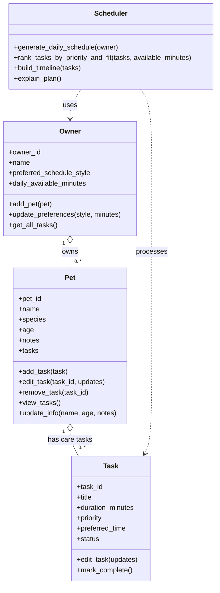

## PawPal+ UML Diagram

```mermaid
classDiagram
  class Owner {
    +owner_id
    +name
    +preferred_schedule_style
    +daily_available_minutes
    +add_pet(pet)
    +update_preferences(style, minutes)
    +get_all_tasks()
  }

  class Pet {
    +pet_id
    +name
    +species
    +age
    +notes
    +tasks
    +add_task(task)
    +edit_task(task_id, updates)
    +remove_task(task_id)
    +view_tasks()
    +update_info(name, age, notes)
  }

  class Task {
    +task_id
    +title
    +duration_minutes
    +priority
    +preferred_time
    +status
    +edit_task(updates)
    +mark_complete()
  }

  class Scheduler {
    +generate_daily_schedule(owner)
    +rank_tasks_by_priority_and_fit(tasks, available_minutes)
    +build_timeline(tasks)
    +explain_plan()
  }

  Owner "1" o-- "0..*" Pet : owns
  Pet "1" o-- "0..*" Task : has care tasks
  Scheduler ..> Owner : uses
  Scheduler ..> Task : processes
```
